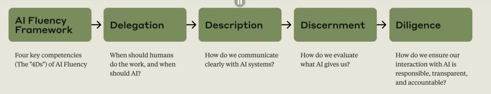

# Introduction to AI Fluency

### Key takeaways
1. This course focuses on human-AI collaboration, not just understanding AI as a technology
2. AI Fluency means engaging with AI systems effectively, efficiently, ethically, and safely
3. The AI Fluency Framework centers on the "4D" competencies of Delegation, Description, Discernment and Diligence
4. The goal is to develop lasting skills that remain relevant as AI technology evolves
5. Effective AI collaboration requires both practical skills and a fundamental shift in how we think about working with AI

## Videos:
1. [Lesson 1: Introduction to AI Fluency](https://www.youtube.com/watch?v=JpGtOfSgR-c)
2. [Lesson 2A: Why do we need AI Fluency?](https://www.youtube.com/watch?v=4szRHy_CT7s)
3. [Lesson 2B: The 4D Framework](https://www.youtube.com/watch?v=W4Ua6XFfX9w)
4. [Lesson 3A: What is generative AI?](https://www.youtube.com/watch?v=RyvXxApfHkk)
5. [Lesson 3B: Capabiliies & Limitations](https://www.youtube.com/watch?v=W5cga7xipRI)
6. [Lesson 4: Delegation Deep Dive](https://www.youtube.com/watch?v=EljzyfdYkrc)
7. Lesson 5 (NOT A VIDEO): Apply your understanding of Delegation to a practical multi-step project you'll work on throughout the rest of this course
8. [Lesson 6: A closer look at Description ](https://www.youtube.com/watch?v=DmgujoZ1mmk)
9. [Lesson 7: Effective prompting techniques (Deep Dive)](https://www.youtube.com/watch?v=2YCaBqP8muw)
10. [Lesson 8: A closer look at Discerment](https://www.youtube.com/watch?v=Y0KidGr9Z2Y)
11. Lesson 9 (NOT A VIDEO): Exercise oon Description and Discernment Loop (see other wiki page in folder)
12. [Lesson 10: A closer look at Diligence](https://www.youtube.com/watch?v=QbLf2zb3oPc)

## Why do we need AI Fluency?
We discuss how AI Fluency involves developing practical skills, knowledge, insights, and values that help you interact with AI systems in ways that are effective, efficient, ethical, and safe. We also introduce three ways people engage with AI:

**Automation**: The AI completes specific tasks based on your instructions.
**Augmentation**: You and AI collaborate as creative thinking and task execution partners.
**Agency**: You configure AI to work independently on your behalf, establishing its knowledge and behavior patterns rather than just giving it specific tasks.

AI like other technology acts as a tool, but no can act as a medium, a collaborator, and a partner as  well. This is a shift in the roles a technology can play and therefore shifts roles humans can play as well. The four core competencies of AI Fluency, or the "4Ds": Delegation, Description, Discernment, and Diligence.

- **Delegation**: Thoughtfully deciding what work to do with AI vs. doing yourself
    - Understand your goal and the problem that you are tryuing to solve.
    - Know what AI systems can and can't do well.
    - Decide how to divide the work between you and AI.
- **Description**: Communicating clearly with AI systems in context rich conversations
    - What you want the final output to be.
    - How you wnat the AI to approach the task.
    - How you want the AI to behave.
- **Discernment**: Thoughtfully evaluating AI outputs and behavior with a critical eye
    - Are the facts accurate?
    - Is te AI taking the right approach?
    - Is the AI behiaving as desired? does it need refinement?
- **Diligence**: Ensuring you interact with AI responsibly
    - How are you ensuring the acuracy and taking responsiblity?
    - Be honest and transparent.
    - Ethical use and critical awareness by yourself and users is key

## AIs Leap into the Spotlight
The concept of  AI as be around for over 70 years and the concept of nueral networks for decades. There were key innovations which made the generative AI technology possible:
1. The Creation of the Transformer Architecture in 2017
2. The access and vast amount of digital data created by humans
3. The improvement of compute via Graphical Processing Units (GPUs) and Tensor Processing Units (TPUs)

Generative AI learns through two stages: pre-training (analyzing patterns across billions of examples) and fine-tuning (learning to follow instructions and provide helpful responses). Current capabilities include versatility across tasks, conversational awareness, and the ability to connect with external tools.Additionally at scale as models grow and ingest more data alongside additional parameters they gain new abilties not explicitly coded into the like reasoning through problems step-by-step.

Context Windows: User Inputs/Prompts + LLMs reponses + and Docments

### Capabilities and Limitations
While LLMs and other generative models are impressive. Their Ccurrent limitations include knowledge cutoff dates, potential for hallucinations, context window constraints, and challenges with complex reasoning
- knowledge cutoff dates: their innate knowledge of the world is based off the recency and density of info from the training data's cut-off date. Can vary per topic.
- potential hallucinations - occur because of bad/inconsistent training data or bad "reasoning" from connections within the conversation. 
- context windows - these can contribute to the hallucinations by having limits on data they can accept as well as utilize efficently.
challenges with complex reasoning - working to improve via **extended thinking** and **complex reasoning**

## Delegation (in-depth)
The three key components of Delegation:

1. Problem Awareness: Understanding your goals and the work involved to achieve it
2. Platform Awareness: Knowing what different AI systems can do
3. Task Delegation: Strategically dividing work between you and AI

We also emphasize why effective Delegation requires both expertise in your field and understanding of AI capabilities —and why it's essential for working effectively and efficiently with AI systems.

### Key takeaways
- Delegation is about making thoughtful decisions about what work to do yourself, what to do together with AI, or what to let AI handle independently, and how to distribute those tasks.
- Problem Awareness means clearly understanding your goals and the nature of the work before involving AI.
- Platform Awareness involves understanding the capabilities and limitations of different AI systems.
- Task Delegation is the process of thoughtfully distributing work between humans and AI to leverage the strengths of each.
- Effective delegation requires both domain expertise and an understanding of AI capabilities.
- The goal isn't to automate everything, but to create the most effective human-AI partnership for any given task or goal.

## Description
Three key components of Description:

1. Product Description: Clearly defining what you want the AI to create
2. Process Description: Guiding how the AI approaches your request
3. Performance Description: Defining how you want the AI to behave during your collaboration.

We also emphasize that AI can't read your mind, and how the quality of your results often comes down to how clearly you articulate your needs, preferred approach, and desired interaction style.

### Key takeaways
- Description is about communicating with AI in ways that create a productive collaborative environment
- Product Description involves clearly defining what you want in terms of outputs, format, audience, and style
- Process Description guides how the AI approaches your request, which can be as important as specifying the end goal
- Performance Description defines behavioral aspects like whether the AI should be concise or detailed, challenging or supportive
- AI systems are interactive partners, not databases or vending machines
- Clear communication up front saves time and leads to better results

### Prompting Tips:
We introduce six foundational techniques: giving context, showing examples of desired outputs, specifying constraints, breaking complex tasks into steps, asking the AI to think first, and defining the AI's role or tone. 

- Effective prompting combines clear communication principles with AI-specific techniques
- Six foundational prompting techniques:
    - Give context: Be specific about what you want, why you want it, and relevant background
    - Show examples: Demonstrate the output style or format you're looking for
    - Specify constraints: Clearly define format, length, and other output requirements
    - Break complex tasks into steps: Guide the AI through multi-step reasoning
    - Ask the AI to think first: Give space for the AI to work through its process
    - Define the AI's role or tone: Specify how you want the AI to communicate
- The "secret weapon": Ask the AI itself to help improve your prompt
- Successful prompting is iterative (and perhaps also collaborative with the AI!). Expect to refine your approach based on results
- Common successful patterns include providing clear task overviews, format specifications, explicit constraints, and relevant background information

## Discernment
Three types of Discernment:

1. Product Discernment: Evaluating the quality of AI outputs
2. Process Discernment: Assessing how the AI approached the task
3. Performance Discernment: Evaluating how the AI behaved during the interaction itself
Together, these skills help ensure that your AI collaboration remains guided by thoughtful human judgment.

### Key takeaways
- Discernment is your ability to thoughtfully evaluate what AI produces, how it produces it, and how it behaves
- Product Discernment focuses on evaluating the quality of actual outputs (accuracy, appropriateness, coherence, relevance)
- Process Discernment involves assessing how the AI arrived at its output, looking for logical errors, attention gaps, or inappropriate reasoning
- Performance Discernment evaluates how the AI behaves within the collaboration process itself, considering whether its - communication style is effective for your needs
- Discernment works hand-in-hand with Description in a continuous feedback loop
- Even the most advanced AI systems benefit from human judgment and oversight

## Dligence
Three components:

1. Creation Diligence: Being thoughtful about which AI systems you choose and how you work with them
    - Which AI systems did you choose to work with and why?
    - What data or information did you share with the AI?
    - Were there any privacy, security, or ethical considerations in your choices?
2. Transparency Diligence: Being open about AI's role in your work
    - Who is the audience for your project output?
    - What expectations might they have regarding AI disclosure?
    - How specifically did AI contribute to different aspects of your work?
3. Deployment Diligence: Taking ownership for AI-assisted outputs you share with others
    - What steps did you take to verify the accuracy and appropriateness of AI contributions?
    - How did you ensure the final output meets your standards and requirements?
    - What responsibility are you taking for the final product?

We emphasize that different contexts may have different expectations, but we each have a responsibility to understand and meet these expectations.

### Key takeaways
- Diligence is about taking responsibility for our AI collaborations
- Creation Diligence involves being thoughtful about which AI systems we use and how we engage with them
- Transparency Diligence means being honest about AI's role in our work with everyone who needs to know
- Deployment Diligence requires taking responsibility for verifying and vouching for the outputs we use or share
- Different contexts (personal, academic, professional) may have different expectations for disclosure and verification
- Thoughtful Diligence helps ensure our AI collaborations are not only effective and efficient, but also ethical and safe

**Staying up to date is apart of diligence. Understanding the latest models, architecture, and the data included.**
